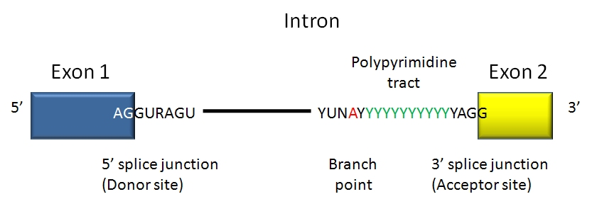

<style>
a:link {
    color: red;
}

a:visited {
    color: green;
}

a:hover {
    color: hotpink;
}
p.caption {
  font-size: 0.8em;
}

</style>

***


```{r eval=FALSE, include=FALSE}
# This is required to load an Example Dataset. This image file must be present in the vignette folder.
  load("exampleData.RData")
  library(dplyr)
```


```{r setup, include=FALSE}
knitr::opts_chunk$set(echo = TRUE)
```

<br><br>


# Introduction

---

Gene annotations for the human genome has been made available by several databases integrating data from systematic explorations of different experimental and computational resources. The **GENCODE** project [1], part of the ENCODE project [2], offers accurate annotations of the human and mouse genomes from the literature, primary data repositories, computational predictions, manual annotation, and experimental validation of genes and transcripts including the noncoding transcripts which are continously discovered and annotated. GENCODE is by large one of the most comprehensive and standardized database for gene annotations that is widely used by the community.\
The gene sets provided by GENCODE are comprehensive and include _protein-coding_ and _non-coding_ loci including _alternatively spliced isoforms_ and _pseudogenes_. GENCODE gene annotations are constantly updated and regularly released as the Ensembl/GENCODE gene sets which are accessible via the official website (https://www.gencodegenes.org). GENCODE gene sets are released on average four times a year for mouse and two times a year for human [1].\
**GencoDymo** is an R package that interrogates different releases of GENCODE annotations from the human and the mouse genomes. GencoDymo extracts and manipulates GENCODE annotations and provides easily-accessible data regarding annotations statistics, releases comparison, in addition to introns and splice sites data. Moreover, GencoDymo can produce fasta files of donor and acceptor splice sites motifs that can be directly uploaded to the **MaxEntScan** tool [3] for the calculation of splice sites scores.

<br>

GencoDymo can be used to import and process any gtf formatted file. It automatizes and speeds up these data manipulation steps:   

 * Extract introns data
 * Assign splice sites consensus sequence
 * Remove redundant exons and introns
 * Compile MaxEntScan splice sites motifs
 * Subset elements on the forward or reverse strand.
 * Calculate transcripts-per-gene frequency
 * Calculate exons-per-transcript frequency
 * Calculate spliced transcripts length
 * Compare annotations from different GENCODE releases.
 * Perform summary statistics analysis
 


***
<br>


# Data Preparation

---

## Download GENCODE annotations
<br>
In this workflow, we will be using the most recent release from GENCODE for the humann genome _(release 32)_ as an example. The analysis will be performed on lncRNAs annotations gtf file and the basic annotations gtf file provided by GENCODE.\
<br>
Create a working directory to store these files.

```{r eval=FALSE}
 # download basic annotations gtf file
download.file(url="ftp://ftp.ebi.ac.uk/pub/databases/gencode/Gencode_human/release_32/gencode.v32.basic.annotation.gtf.gz", destfile = "gencode.v32.basic.annotation.gtf.gz", method = "wget")

 # download lncRNAs annotations gtf file
download.file(url="ftp://ftp.ebi.ac.uk/pub/databases/gencode/Gencode_human/release_32/gencode.v32.long_noncoding_RNAs.gtf.gz", destfile = "gencode.v32.long_noncoding_RNAs.gtf.gz", method = "wget")
```

<br>

## Load a BSgenome object
<br>
GencoDymo requires a BSgenome object for the extraction of splice sites consensus and motifs sequences. For this workflow, we will be using the human genome sequence _(hg38)_
<br>
```{r eval=FALSE}
 # Load BSgenome object
   library(BSgenome.Hsapiens.UCSC.hg38)
   hg38 <- BSgenome.Hsapiens.UCSC.hg38::BSgenome.Hsapiens.UCSC.hg38
```

<br>

## Import input files
<br>
Start by loading GencoDymo package
<br>
```{r eval=FALSE}
 # Load BSgenome object
   library(GencoDymo)
```

<br>
   
The <span style="color:coral">`load_gtf()`</span> function imports any gtf.gz file as a dataframe in the R environment.  

```{r eval=FALSE}
 # Import basic annotations gtf as a dataframe
   gen32 <- load_gtf("gencode.v32.basic.annotation.gtf.gz")
 # Import lncRNAs annotations gtf as a dataframe
   gen32_lncRNA <- load_gtf("gencode.v32.long_noncoding_RNAs.gtf.gz") 
```

***
<br>

# Extract protein-coding genes

---

Basic annotation files in GENCODE are a subset of the corresponding comprehensive annotation, including only those transcripts tagged as _'basic'_ in every gene. This subset prioritises full-length protein coding transcripts over partial or non-protein coding transcripts within the same gene, and intends to highlight those transcripts that will be useful to the majority of users.\
The basic annotation file contains all gene classes annotated by GENCODE (lncRNAs, pseudogenes, tRNAs, scRNA...) in addition to the protein-coding genes. 
   
<br>

The <span style="color:coral">`extract_pc()`</span> function subset the basic annotation dataframe extracting only data marked with the biotype **"protein-coding"**. The function assign in the global environment a new dataframe called: **pc_df** that contains annotated protein-coding genes, transcripts and exons.   


```{r eval=FALSE}
  # Extract protein-coding genes from basic annotation file
    pc_df <- extract_pc(gen32)
```

***
<br>

# Introns data manipulation

---

## Extract introns

<br>

The gtf files provided by GENCODE (for example the lncRNAs annotations gtf file) contains data regarding genes, transcripts, and exons only. Given the loaded data frame from the gtf files of GENCODE, the <span style="color:coral">`extract_introns()`</span> function produces a dataframe containing all the intronic regions in between all of those exons.


```{r eval=FALSE}
# Extract introns from the gtf file of lncRNAs
  gen32_lncRNA_introns <- extract_introns(gen32_lncRNA)
 
```

<br>

The obtained data frame includes the introns coordinates, their corresponding gene and transcripts ids, and the ordinal position of the intron.

<br>

## Assign the donor and acceptor splice sites of GENCODE annotated introns

<br>

Introns always have two distinct nucleotides at either end. At the 5' end, the splice donor site includes an almost invariant sequence GT (GU in the RNA). The splice acceptor site at the 3' end of the intron terminates the intron with an almost invariant AG sequence.

<br>



<br>

The majority of introns belong to the U2-type spliceosome and are flanked by GT–
AG splice site dinucleotides. The most frequent exception to this rule are the U2-type GC–AG splice sites, comprising ∼0.8% of human splice sites and about ∼0.09% of the human splice sites belong to the U12-type which are processed by the minor spliceosome
and are flanked by AT–AC dinucleotides [4].

<br>

The <span style="color:coral">`assign_ss()`</span> function adds two new columns to the introns data frame, assigning both the 5' and 3' splice sites. The sequences are retrieved from the loaded BSgenome object. 

The first argument of the function is a dataframe containing intronic coordinates and a second argument should specify the genome sequence of the studied species (the human genome sequence hg38 is used by default). 

```{r eval=FALSE}
intr_splice_sites <- assign_ss(gen32_lncRNA_introns, genome = hg38)
```

<br>

## Extract splice sites motifs for MaxEntScan webtool

<br>

**MaxEntScan** is a webtool based on the approach for modeling the sequences of short sequence motifs such as those involved in RNA splicing which simultaneously accounts for non-adjacent as well as adjacent dependencies between positions. This method is based on the _'Maximum Entropy Principle'_ and generalizes most previous probabilistic models of sequence motifs such as weight matrix models and inhomogeneous Markov models [3]. \
The **MaxEntScan::score5ss** assign scores for donor splice sites according to four models (http://hollywood.mit.edu/burgelab/maxent/Xmaxentscan_scoreseq.html) by using **9-mer SEQUENCES** motif as input in a .fa file. The 9-mers motif contain 3 bases in the exon and 6 bases in the intron. \
The **MaxEntScan::score3ss** assign scores for donor splice sites according to three models (http://hollywood.mit.edu/burgelab/maxent/Xmaxentscan_scoreseq_acc.html). It takes as input a .fa file of **23-mer SEQUENCES** in which 20 bases are in the intron and 3 bases in the exon.

<br>

The <span style="color:coral">`extract_5ss_motif()`</span> and <span style="color:coral">`extract_3ss_motif()`</span> functions are used along with BSgenome objects of the studied species to retrieve _MaxEntScan::score5ss_ and _MaxEntScan::score3ss_ motif sequences respectively. \
The functions generate a **fasta file** in the working directory as an output, that contains either 9-mers or 23-mers, respectively for each 5' and 3' splice-sites, and a **dataframe** for the coordinates and IDs of the corresponding motifs. \
The generated fasta files can then be directly utilized by _MaxEntScan_ tools.

<br>

Two arguments must be specified in each of the above functions. The first argument is a dataframe containing the intron coordinates and the second argument is a BSgenome object (the human genome sequence hg38 is used by default). 


```{r eval=FALSE}
# Produce a fasta file with 5'ss 9-mers:
extract_5ss_motif(gen32_lncRNA_introns, BSgenome.Hsapiens.UCSC.hg38)
# Produce a fasta file with 3'ss 23-mers:
extract_3ss_motif(gen32_lncRNA_introns, BSgenome.Hsapiens.UCSC.hg38)
```

<br>

> **_NOTE:_** When the above functions are used with the data frame of the entire introns of the GENCODE gtf files, they might take up to several minutes until the computation is done.

***
<br>

# Data Manipulation of Exons and Introns

---

## Extract the _single-exon_ genes and transcripts ID

<br>

Some genes are composed by one single exon and have no introns.   
The <span style="color:coral">`se_genes()`</span> function extract all the **_single-exon_** genes and returns in a dataframe their ensembl gene IDs.

<br>

```{r eval=FALSE}
# Extract single-Exon genes:
  se_genes(gen32)
  se_genes(gen32_lncRNA)
```

<br>

The <span style="color:coral">`se_transcripts()`</span> function extract all the **_single-exon_** transcripts and returns in a dataframe their ensembl transcript IDs.  
<br>

```{r eval=FALSE}
# Extract single-Exon transcripts:
  se_transcripts(gen32)
  se_transcripts(gen32_lncRNA)
```

<br>

## Assign the ordinal position of exons as single, first, inner, or last

<br>

The <span style="color:coral">`classify_exons()`</span> function adds a new column to the dataframe called **_"EXON_CLASSIFICATION"_**, describing the position of each exon. Four categories are automatically generated: _(first_exons)_, _(inner_exons)_, _(last_exons)_ and _(single_exons)_.   


```{r eval=FALSE}
# Annotate each exons as first, inner, last or single exons.
  classified_exons_df <- classify_exons(gen32_lncRNA)
```

<br>

This classification is informative and useful for subsequent analysis, considering that first and last exons often have peculiar regulative roles.   

<br>

## Redundant exons and introns

<br>

The <span style="color:coral">`eliminate_redundant_exons()`</span> function is used to retain unique exons only, removing all redundant ones.
In fact, in genes with multiple transcripts, some exons are not alternatively spliced and will be represented multiple times within the gtf file. This function takes an exon-containing dataframe as input and returns a data frame with unique exons only.

<br>

```{r eval=FALSE}
# Remove redundant exons
eliminate_redundant_exons(gen32_lncRNA)
```

<br>

The <span style="color:coral">`eliminate_redundant_introns()`</span> function is used to retain unique introns only, removing redundant ones.

<br>

```{r eval=FALSE}
# Remove redundant introns
eliminate_redundant_introns(introns_df)
```

***
<br>


# GENCODE data summary statistics 

---

GencoDymo package provide a number of functions that gives a brief summary of data annotations in a particular GENCODE release regarding genes, transcripts, exons and introns of lncRNAs and protein-coding genes. Moreover, the package can compare different releases of GENCODE showing the variation in the number of annotations between them

<br>

## Compare annotations from GENCODE different releases

<br>

As GENCODE regularly updates its annotations, different releases from GENCODE contain differing number of annotations. Some genes are added in new releases while others are classified into different gene classes. In the majority of cases, the ensembl gene ID of genes remains constant while the gene name might vary. 

The <span style="color:coral">`gencode_compare()`</span> function compares two different releases of GENCODE annotations. \
The function takes three arguments: the _first release data frame_, _the newer release data frame_, and the _type_. The type represent the genetic element to be compared which can be _"gene"_, _"transcript"_, _"exon"_ or _"intron"_.

<br>


Let's load first in addition to the gtf file of lncRNAs annotations from release 32 _(gen32_lncRNA)_, the gtf file of release 30.

<br>

```{r eval=FALSE}
# download gtf file of lncRNA annotations from release 30
  download.file(url="ftp://ftp.ebi.ac.uk/pub/databases/gencode/Gencode_human/release_30/gencode.v30.long_noncoding_RNAs.gtf.gz", destfile = "gencode.v30.long_noncoding_RNAs.gtf.gz", method = "wget")

# load the downloaded gtf file as a data frame in r
  gen30_lncRNA <- load_gtf("gencode.v30.long_noncoding_RNAs.gtf.gz")
  gen30_lncRNA_introns <- extract_introns(gen30_lncRNA)
```

<br>

Now let's compare the different number of genes, transcripts, exons and introns between these two releases:

<br>

```{r eval=FALSE}
# Calculates the number of differing genetic elements
  gencode_compare(gen30_lncRNA, gen32_lncRNA, type = "gene")
  gencode_compare(gen30_lncRNA, gen32_lncRNA, type = "transcript")
  gencode_compare(gen30_lncRNA, gen32_lncRNA, type = "exon")
  gencode_compare(gen30_lncRNA_introns, gen32_lncRNA_introns, type = "intron")
```

<br>

The function produces as an outout a _**Delta**_ value, that corresponds to the difference in number between the specified elements of the two inputs, in addition to its **_Percentage_**.

<br>

The output is summarised in Table1.

<br>

Table 1. Number and percentage of the different genetic elements between release 30 and release 32 of GENCODE for lncRNAs.

Genetic Element | Release 30  | Release 32 | Delta | Percentage (%)
---- | -----  | ---- | ---- | ----
Genes | 16193 | 17910 | 1717 | 9.58
Transcripts | 30369 | 48351 | 17982 | 37.19
Exons | 96215 | 176413 | 80198 | 45.46
Introns | 65846 | 128062 | 62216 | 48.58


<br>


## Number of transcripts per gene

<br>

The <span style="color:coral">`genes_freq()`</span> function is used to produce a **Transcripts per Gene frequency table**. This table describes the number and the percentage of genes for which a given number of transcript isoforms exist.

<br>

```{r eval=FALSE}
# Transcripts per Gene frequency table:
  genes_freq_df <- genes_freq(gen32_lncRNA)

```

<br>

The output is a data frame composed of the following columns:

* The first column represents the number of transcript isoforms per gene.   
* The second column describes how many genes correspond to such isoforms number.   
* The third column reports the percentage of such elements.   

<br>

## Number of exons per transcript

<br>

The <span style="color:coral">`trans_freq()`</span> function is used to produce an **Exons per Transcript frequency table**. This table describes the number and the percentage of transcripts that are composed by a certain number of exons.

<br>

```{r eval=FALSE}
# Exons per transcript frequency table:
  trans_freq_df <- trans_freq(gen32_lncRNA)

```

 <br>

The output is a data frame composed of the following columns:

* The first column represents the number of exons per transcript.     
* The second column describes how many transcripts contain the specified number of exons.      
* The third column reports the percentage of such elements.   

<br>

## Spliced transcripts length

<br>

The <span style="color:coral">`spliced_trans_length()`</span> function calculates the length of each transcript in its mature form (following the splicing of its introns).

<br>

```{r eval=FALSE}
# Length of spliced transcript  
  spliced_trans_length(gen32_lncRNA)
```

<br>

## Exons length summary statistics

<br>

The <span style="color:coral">`stat_exon()`</span> function produces a data frame describing the _mean_, _median_, _standard deviation_ and _std error_ of exons' length. \
The function describes these parameters for exons taking into consideration their ordinal position.

<br>

```{r eval=FALSE}
# Calculates mean, median, sd and std error of exons
  stat_exon(gen32_lncRNA)
```

<br>

The output is generated for _single exons_, _first exons_, _inner exons_, and _last exons_. Length is reported in base pairs (bp). 


## Introns Statistics

<br>

The <span style="color:coral">`stat_intron()`</span> function produces a data frame describing the _mean_, _median_, _standard deviation_ and _std error_ of introns' length. \
The function describes the length of introns taking into consideration also whether they are first or inner, and from each category whether it harbors _GT-AG_, _GC-AG_ or _AT-AC_ splice sites. This classification could be of particular relevance as introns haroboring different splice sites have different length characteristics as reported in [5].

<br>

```{r eval=FALSE}
# Calculates mean, median, sd and std error of introns
stat_intron(introns_ss)
```

<br>

Length is reported in base pairs (bp).

***
<br>

# Session information

---

The following provides the session information used when compiling this document.

```{r eval=TRUE}
   devtools::session_info()
```


***
<br>

# References

---

1. Frankish A, Diekhans M, Ferreira AM, Johnson R, Jungreis I, Loveland J et al. _“GENCODE reference annotation for the human and mouse genomes”_. Nucleic Acids Res. 2019. 47: D766–773. doi: 10.1093/nar/gky955.
2. Harrow J, Denoeud F, Frankish A, Reymond A, Chen CK,
Chrast J et al. _"GENCODE: producing a reference annotation for ENCODE"_.
Genome Biol. 2006. 7 Suppl 1:S4.1-9. doi: 10.1186/gb-2006-7-s1-s4.
3. Yeo G and Burge CB. _“Maximum entropy modeling of short sequence motifs with applications to RNA splicing signals”_. J Comput Biol. 2004. 11:377-394. doi: 10.1089/1066527041410418.
4. Parada GE, Munita R, Cerda CA and Gysling K. _“A comprehensive survey of non-canonical splice sites in the human transcriptome”_. Nucleic Acids Res. 2014. 42: 10564-10578. doi: 10.1093/nar/gku744.
5. Abou Alezz M, Celli L, Belotti G, Lisa A and Bione S. _"Unexpected features of GC-AG introns in long non-coding and protein-coding genes suggest a new role as regulatory elements"_. bioRxiv. 2019. doi: 10.1101/683938
